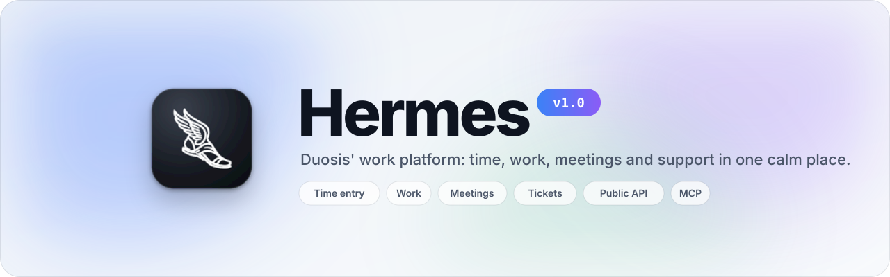
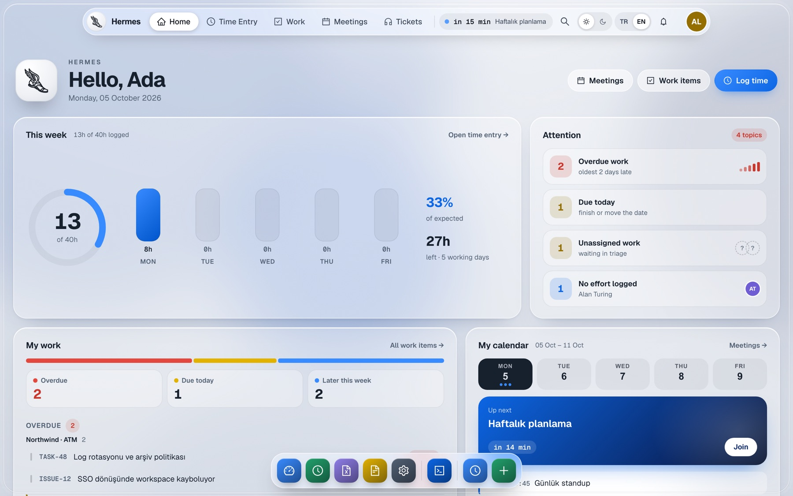
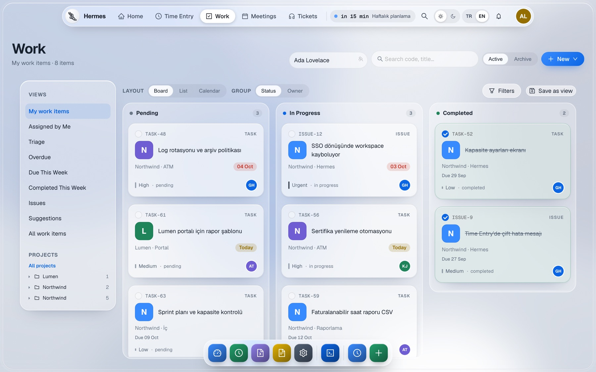
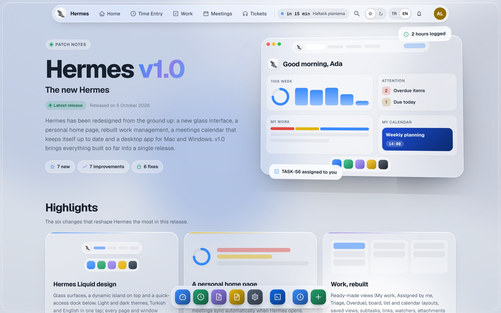
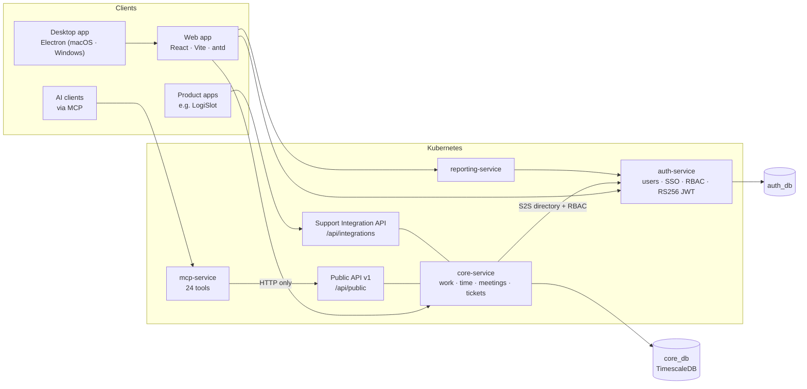

<div align="center">

<picture>
  <source media="(prefers-color-scheme: dark)" srcset="docs/readme/hero-dark.svg">
  
</picture>

<br/>

[](https://hermes.duosis.com/patch-notes)
[](frontend)
[](backend)
[](backend)
[](k8s)
[](desktop)

**[Open Hermes](https://hermes.duosis.com)** · **[Patch notes](https://hermes.duosis.com/patch-notes)** · **[Architecture](#architecture)** · **[Development](#development)**

</div>

---

Hermes is where Duosis tracks its work. One place for the hours the team logs, the work items it ships, the meetings it attends and the support tickets it resolves for every product. On top of that sits a developer platform: a versioned Public API and an MCP server for AI clients.

<picture>
  <source media="(prefers-color-scheme: dark)" srcset="docs/readme/home-dark.jpg">
  
</picture>

## What's inside

<table>
  <tr>
    <td width="50%" valign="top">
      <h3>⏱&nbsp; Time entry</h3>
      Weekly timesheet with a single “+” per day, effort by customer, project and work type, billable hours and month-end Excel exports.
    </td>
    <td width="50%" valign="top">
      <h3>✅&nbsp; Work</h3>
      Tasks, issues and suggestions as one work-item model. Board, list and calendar layouts, saved views, subtasks, links, watchers, attachments and project members.
    </td>
  </tr>
  <tr>
    <td valign="top">
      <h3>📅&nbsp; Meetings</h3>
      Outlook meetings sync automatically onto an hourly grid (Day, Work week, Week, Agenda). Log effort from a meeting in one click.
    </td>
    <td valign="top">
      <h3>🎧&nbsp; Ticket Hub</h3>
      The canonical support system for every Duosis product. Agent hub, customer portal and an integration API with signed webhooks.
    </td>
  </tr>
  <tr>
    <td valign="top">
      <h3>🔐&nbsp; Multi-tenant &amp; RBAC</h3>
      Tenant from the host, Microsoft Entra SSO with domain-based auto-join, role-based permissions and sliding sessions (1 day, or 30 with “Keep me signed in”).
    </td>
    <td valign="top">
      <h3>🧩&nbsp; Developer platform</h3>
      Public API v1 with scopes, data-access bindings, idempotency and per-token rate limits. MCP server with 24 tools. Developer portal in TR/EN.
    </td>
  </tr>
</table>

<picture>
  <source media="(prefers-color-scheme: dark)" srcset="docs/readme/tasks-dark.jpg">
  
</picture>

## Hermes Liquid

v1.0 ships **Hermes Liquid**, a new design system: glass surfaces over a soft liquid backdrop, a dynamic island for navigation, a magnifying dock for modules, and light/dark themes with Turkish and English throughout. Colours, radii, motion and type all come from one token set ([`frontend/src/styles/tokens.css`](frontend/src/styles/tokens.css)), so both themes stay in step.

The same web app runs in the **desktop app** for macOS (Apple Silicon and Intel) and Windows. The Electron shell in [`desktop/`](desktop) loads Hermes from the server, so every web release reaches it without reinstalling.

## Releases & patch notes

The version badge in the app's top-right corner opens **[/patch-notes](https://hermes.duosis.com/patch-notes)**. That page shows the highlights and the full list of changes in every release.

<picture>
  <source media="(prefers-color-scheme: dark)" srcset="docs/readme/patch-notes-dark.jpg">
  
</picture>

Versions read `MAJOR.MINOR[.PATCH]`: small updates move like `v1.1` or `v1.2.5`, and big changes become `v2.0`.

To ship a release:

1. Add an entry at the top of [`features/releases/releases.js`](frontend/src/features/releases/releases.js). That entry becomes the app's version.
2. Add the `releases.<key>.*` texts to both [`tr.js`](frontend/src/i18n/tr.js) and [`en.js`](frontend/src/i18n/en.js).

Tests check the order, the version format and that every text exists in both languages.

## Architecture



| Service | Path | Responsibility |
|---|---|---|
| **auth-service** | [`backend/auth-service`](backend/auth-service) | Users, tenants, Microsoft SSO, RBAC roles, RS256 tokens, sliding sessions |
| **core-service** | [`backend/core-service`](backend/core-service) | Business logic, the isolated Public API (`app/public_api`) and Support Integration API (`app/support_api`) |
| **reporting-service** | [`backend/reporting-service`](backend/reporting-service) | Dashboards and reports |
| **mcp-service** | [`backend/mcp-service`](backend/mcp-service) | MCP server; talks to the Public API over HTTP only (no DB driver) |
| **frontend** | [`frontend`](frontend) | React SPA: app shell, landing page, patch notes, developer portal |
| **desktop** | [`desktop`](desktop) | Electron shell and installers (`.dmg`, `.exe`) |
| **k8s** | [`k8s`](k8s) | Manifests for the `hermes-dev` and `hermes-test` namespaces |

Every schema change is an additive Alembic revision. Tenant-owned tables use row-level security. Each environment's CD pipeline runs four gates (backend tests, MCP tests, frontend tests and a production build) before it deploys images pinned to a commit SHA.

## Development

```bash
# Backend tests run against a real PostgreSQL
docker run -d --name hermes-test-pg -e POSTGRES_USER=hermes \
  -e POSTGRES_PASSWORD=hermes -e POSTGRES_DB=hermes_test \
  -p 55433:5432 postgres:15-alpine
export JWT_PUBLIC_KEY=test-only-not-a-real-key

cd backend/core-service && python -m pytest tests/ -q
cd backend/auth-service && python -m pytest tests/ -q
cd backend/mcp-service  && python -m pytest tests/ -q

# Frontend
cd frontend && npm ci
npm run dev            # Vite dev server
npm test               # Vitest
npm run build          # production build

# Desktop installers
cd desktop && npm ci
npm run dist:arm64     # macOS Apple Silicon (.dmg)
npm run dist:x64       # macOS Intel (.dmg)
npm run dist:win       # Windows (.exe)
```

| Branch | Environment | Deploys via |
|---|---|---|
| `dev` | development | [`.github/workflows/cd-dev.yml`](.github/workflows/cd-dev.yml) |
| `test` | production-like, **hermes.duosis.com** | [`.github/workflows/cd-test.yml`](.github/workflows/cd-test.yml) (fast-forward from `dev` only) |

## Documentation

- [Support ticketing operations](docs/support-ticketing.md) and the [frozen ticket contract](docs/contracts/support-ticketing-v1)
- [Observability: metrics contract](docs/observability-metrics.md)
- [Work-management rework plans](docs/pm-rework)
- [MCP server design](hermes_mcp_server_design.md) · [RBAC design](hermes_rbac_design.md)
- [Original PRD (2025)](docs/history/2025-11-prd-v1-v2.md) · [Original technical architecture](docs/history/2025-11-technical-architecture-v1.md)

<div align="center">
<br/>
<sub>Built by the Duosis team · Screenshots use fictional demo data</sub>
</div>
